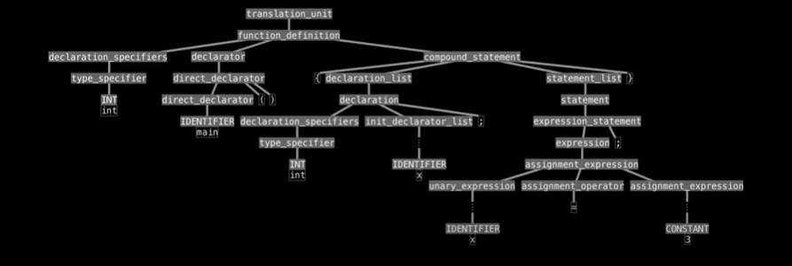

```diff
- text in red
+ text in green
! text in orange
# text in gray
@@ text in purple (and bold)@@
```


## STEP1 Lexical Analysis (tokenizer, scanner)
#### Letters >>to words/token

```javascript
int main() {
    int x;
    x = 3;
}
```

For the computer it's just a meaningless sequence of letters/characters :
```javascript
int•main()•{\n\tint•x;\n\tx•=•3;\n}\n
```

First step divides the text up into individual "tokens".
Characters/letters become words/tokens :

```diff
-   int
-   main
-   (
-   )
-   {
-   int
-   x
-   ;
-   x
-   =
-   3
-   ;
-   }
```


## STEP2 Syntactic Analysis
#### Tokens >>to Parser tree

Tokens are organized into a hierarchical structure, a parse tree :



Figuring out what the grammar is.


## STEP3 Semantic Analysis
#### Symbol Table

Records context about the program : variable, function names

